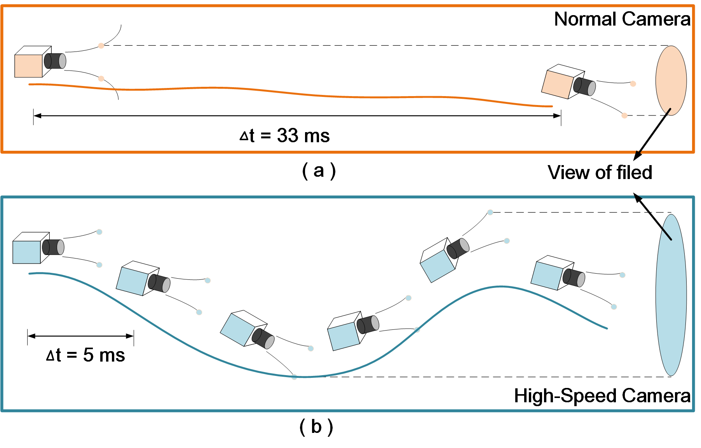
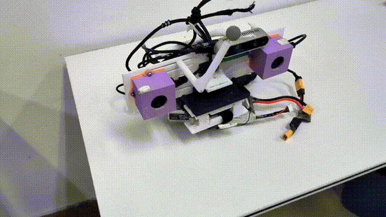

# **SwiftBase: A dataset based on high-frequency visual measurement for **Visual-Inertial Localization in high-speed motion scenes

### Abstract

​    This is a visual-inertia dataset for high-speed motion. The data collection platform uses two IDS U3-3041le-REV high-speed cameras and one Parker 3DMGQ7-GNSS/INS IMU. Keep the camera sampling frequency at 200Hz and compress the image in grayscale. The IMU sampling frequency is 200Hz.

​     The data platform and dataset are constructed and maintained by the Information Fusion Technology Laboratory of the School of Automation, Northwestern Polytechnical University, China. If you have any questions, please try contacting us:

**Author:** Zhenghao Zou, Chunhui Zhao, Xirui Kao, Jiangbo Liu, HaoChen Chai and Yang Lyu*

**Contact information:** zouzhenghao@nwpu.edu.cn

**Paper:**  SwiftBase: A dataset based on high-frequency visual measurement for

Visual-Inertial Localization in high-speed motion scenes （IROS 2024）

---

### Introduction

​	Using high-speed cameras can obtain more detailed process states, thereby improving the robustness and accuracy of visual SLAM. At the same time, high-frequency measured visual images can significantly improve feature tracking capabilities and alleviate image blur caused by high-speed motion. refer to:

```
@inproceedings{c9,
  title={Improving Localization Robustness in Monocular SLAM Using a High-Speed Camera},
  author={Gemeiner, Peter and Davison, Andrew J. and Vincze, Markus},
  booktitle={Robotics: Science and Systems IV},
  year={2008},
  organization={MIT Press}
}
```



   Then we will introduce the experimental scenario and dataset. The research room scenario provides stable lighting and complex feature environments, and the data is collected using handheld devices; The laboratory has designed high-speed sports aimed at challenging extreme sports, using suspension ropes and rolling pulleys to achieve high-speed rotation and sliding. We offer only ROS bag formats and calibration result. To provide groud truth, a motion capture system, Optitrack, uses 360Hz for high-speed tracking.  We performed some necessary processing on the data, including data timing check, data reduction and platform calibration.

   We believe that we have provided some motion condition and designed some challenging problems for visual inertia SLAM, and hope to explore the practical application of VI-SLAM with relevant researchers in high-speed motion scene.

​    Now, this dataset has been open for public, you can get data from google drive or baidu drive. Thank you for using! 


---

#### Examples

* platform




* **sequence** (low-comb)


* **sequence** (middle-comb)


* **sequence** (high-comb)


**More details will open later!**

---

### **Data Retrieve**

#### Google Drive

https://drive.google.com/drive/folders/1lwLOps9IEREn25w_IaCFSfaC7x56qSB7?usp=drive_link

In groudtruth(GT), red point is start point and green point is end point.

| Sequence            | Duration（s） | Size（Mb） | Dist（m） | ROSbag                                                       | Translate | Rotation | Video | GT                                                           |
| ------------------- | ------------- | ---------- | --------- | ------------------------------------------------------------ | --------- | -------- | ----- | ------------------------------------------------------------ |
| low_trans           | 90            | 708        | 23.218    | [low_trans](https://drive.google.com/file/d/1irXh9KgazcTwCO26oSpeHJsE4pKhx_AP/view?usp=drive_link) | low       | none     |       |  |
| low_rot             | 113           | 798        | 12.485    | [low_rot](https://drive.google.com/file/d/1XK7oMlsZ-07NL4M49tnbgZSWljLmPxV2/view?usp=drive_link) | none      | low      |       |  |
| low_comb            | 122           | 845        | 22.333    | [low_comb](https://drive.google.com/file/d/15WL9QSQ9VzETQgV4uN1tnsc3QIwXMvmZ/view?usp=drive_link) | low       | low      |       |  |
| mid_trans           | 56.6          | 429        | 16.331    | [mid_trans](https://drive.google.com/file/d/1YFedZHK6MfGUEi1A5-ItS20lYYriwHBo/view?usp=drive_link) | middle    | none     |       |  |
| mid_rot             | 106           | 707        | 12.552    | [mid_rot](https://drive.google.com/file/d/1KmQY9uogmZFjSFpBhqVzcUlGGqVz-Uw2/view?usp=drive_link) | none      | middle   |       |  |
| mid_trans_low_rot   | 59            | 356        | 7.603     | [mid_trans_low_rot](https://drive.google.com/file/d/1-s_uqeVN_ydxW2Tze5KyLI9njDBWgwCT/view?usp=drive_link) | middle    | low      |       |  |
| low_trans_mid_rot   | 82            | 514        | 13.949    | [low_trans_mid_rot](https://drive.google.com/file/d/1-Mf2pyiS8zVLWVc386vA7thlHF1VEtSQ/view?usp=drive_link) | low       | middle   |       |  |
| mid_trans_mid_rot   | 66            | 414        | 12.219    | [mid_trans_mid_rot](https://drive.google.com/file/d/1y_qGAFSPDo7RUmycLu4_djXPG9qOv6M8/view?usp=drive_link) | middle    | middle   |       |  |
| high_trans          | 79            | 550        | 11.185    | [high_trans](https://drive.google.com/file/d/1GzBecbUjIUjwCgsFbZt_lru1F1c8tqh_/view?usp=drive_link) | high      | none     |       |  |
| high_rot            | 111           | 775        | 16.618    | [high_rot](https://drive.google.com/file/d/1juVUzYHk-5iVgGS4pU3gldWTqoiNzuHu/view?usp=drive_link) | none      | high     |       |  |
| high_trans_low_rot  | 62            | 423        | 10.690    | [high_trans_low_rot](https://drive.google.com/file/d/14MmG8iTHF1sPVlnO_psFOwagPrm_FQ00/view?usp=drive_link) | high      | low      |       |  |
| low_trans_high_rot  | 77            | 469        | 16.101    | [low_trans_high_rot](https://drive.google.com/file/d/1EW7FpRkUpCHdU_E2Y4YLxJcRlQv7kpnd/view?usp=drive_link) | low       | high     |       |  |
| high_trans_mid_rot  | 56.9          | 315        | 16.020    | [high_trans_mid_rot](https://drive.google.com/file/d/13-YMbhajmFcwP24HLAjVtSl5hM02YHLu/view?usp=drive_link) | high      | middle   |       |  |
| mid_trans_high_rot  | 89            | 524        | 17.543    | [mid_trans_high_rot](https://drive.google.com/file/d/1yP0_OA8p7jhz19B3sT6hY-FzSzcRD5Kw/view?usp=drive_link) | middle    | high     |       |  |
| high_trans_high_rot | 96            | 566        | 20.386    | [high_trans_high_rot](https://drive.google.com/file/d/1lHTILRb7jAY1yahYM9K6Phz1LnAGTtYo/view?usp=drive_link) | high      | high     |       |  |
| calibr              | 50            | 382        | ---       | [calibr](https://drive.google.com/file/d/1t1W_ANYqE0TTC5rplTAXBfsvegPqg_Hy/view?usp=drive_link) | ---       | ---      | ---   | ---                                                          |
| calibr_result       | ---           | 5.00       | ---       | [calibr_result](https://drive.google.com/file/d/1Tj5FZqWKDeew6xC544j3WERjV1HBED2m/view?usp=drive_link) | ---       | ---      | ---   | ---                                                          |


---

#### Baidu Netdisk

need time!


---

### Reference

If you need academic citations, please follow the Bibtex format:

```latex
@inproceedings{SwiftBase,
  title={SwiftBase: A dataset based on high-frequency visual measurement for Visual-Inertial Localization in high-speed motion scenes},
  author={Zhenghao Zou, Chunhui Zhao, Xirui Kao, Jiangbo Liu, HaoChen Chai and Yang Lyu},
  booktitle={2024 IEEE/RSJ International Conference on Intelligent Robots and Systems (IROS)},
  pages={XX--XX},
  year={2024},
  organization={IEEE}
}
```

